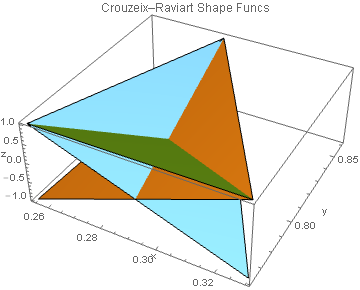

# Δ **P**1 CR — Δ P0 L Interpolant Visualization for Velocity Field and Pressure Distribution

This is how current project is organized:

1. First, we generate symbolic mesh and convert it to CATSPDEs format w/ [`./Mathematica/Generate Mesh/generateMesh.nb`](Mathematica/Generate Mesh/generateMesh.nb).

2. Then we import generated mesh w/ cpp unit, [`./user.cpp`](user.cpp), (uniformly) refine it if necessary, and add ribs’ (middle nodes’) numeration (i.e. convert mesh from “Nodes and Triangles” to “Nodes, Simple Ribs, and Triangles” format).
   
   One needs to enumerate ribs since their numeration, in fact, is a numeration of DOFs for Crouzeix–Raviart finite elements (Δ P1 CR). We will use them for velocity components.
   
   DOFs enumeration for Δ P0 L finite elements (which are used for pressure distribution) is simple and is induced by triangles’ numeration.
   
   [`./user.cpp`](user.cpp) also provides vectors `u1Vec`, `u2Vec`, and `pVec` for further processing.

3. [`./Mathematica/Draw Interpolant/drawInterpolant.nb`](Mathematica/Draw Interpolant/drawInterpolant.nb) then loads resulting from (1 – 2) mesh and vectors.

   It provides all post–processing stuff:
   * visualizing resulting mesh,
   * plotting FE interpolants *P* ( `u1Vec` ), *P* ( `u2Vec` ), *P* ( `pVec` ) (also as a vector velocity field w/ background density plot for pressure distribution),
   * computing L2–norms of errors,
   * etc.
   
## Some Post–processing Results

### Shape Functions

### Mesh

Check out (global and local) nodes’, ribs’, and triangles’ numerations (high–res): [./img/fineMeshNumn.png](img/fineMeshNumn.png)

### FE–Interpolants

	 
— Žilyakov Alexander, Oct 2016
